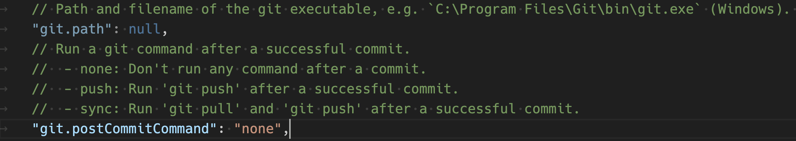
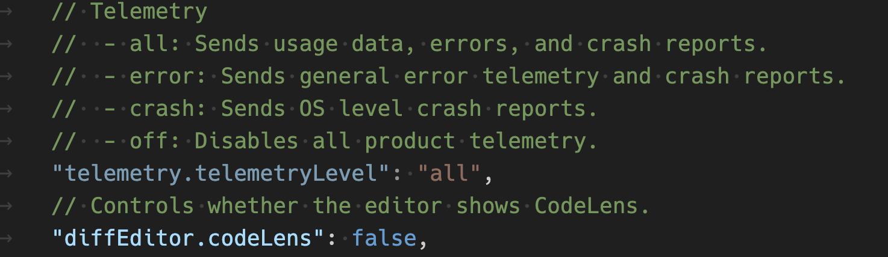

# Visual Studio Code

## Visual Studio Code default settings reference

* https://code.visualstudio.com/docs/reference/default-settings

## Configure settings in VS Code

* https://code.visualstudio.com/docs/editor/settings

* 针对不同编程语言的设置, 在配置文件中搜索 `Configure settings to be overridden for the`

* 像下面 git.path 这种在配置文件中不能高亮显示的说明这种配置项只能在用户空间设置, 不能在 workspace 里面设置





## What is a VS Code workspace?

* https://code.visualstudio.com/docs/editor/workspaces/workspaces

## task definitions

## debugging launch

### Visual Studio Code debug configuration

* https://code.visualstudio.com/docs/editor/debugging


## Variables reference
变量参考

* https://code.visualstudio.com/docs/reference/variables-reference

Visual Studio Code supports variable substitution in Debugging and Task configuration files, and for some select settings. Variable substitution is supported inside some key and value strings in `launch.json` and `tasks.json` files by using the ${variableName} syntax.
Visual Studio Code 支持在调试和任务配置文件以及某些选择设置中进行变量替换. 使用 ${variableName} 语法, 支持在 `launch.json` 和 `tasks.json` 文件中的某些键和值字符串中进行变量替换.


```bash
python -m venv .env

source .env/bin/activate

```
